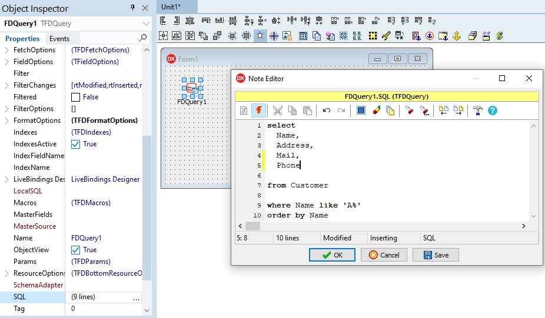
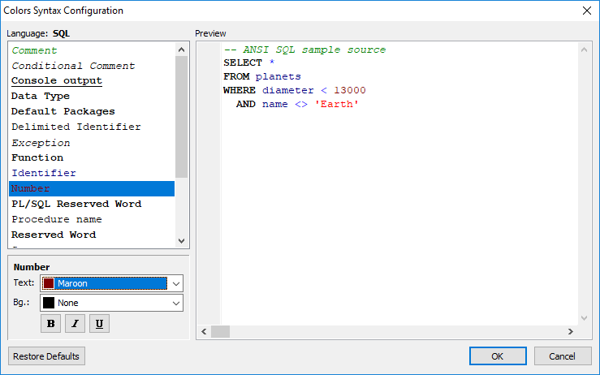
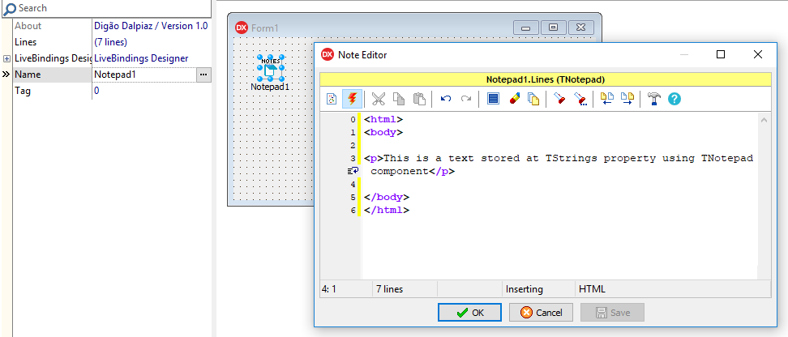

# DzNoteEditor

## Delphi Property Editor for TStrings supporting formatted languages with syntax highlight

- [What's New](#whats-new)
- [Component Description](#component-description)
- [How to install](#how-to-install)
- [Hidden Shortcuts](#hidden-shortcuts)
- [TNotepad Component](#tnotepad-component)
- [Syntax Supported Formats](#syntax-supported-formats)
- [CnPack CnWizards conflict](#cnpack-cnwizards-conflict)

## What's New

- 02/01/2021 (Version 1.5)

   - Removed Delphi XE2 from the list of environments as it was never possible to compile in this version.

- 12/18/2020 (Version 1.4)

   - Updated Component Installer app (Fixed call to rsvars.bat when Delphi is installed in a path containing spaces characters).

- 10/31/2020 (Version 1.3)

   - Included Delphi 10.4 auto-install support.

- 10/27/2020 (Version 1.2)

   - Fixed previous Delphi versions (at least on XE2, XE3, XE4 and XE5) package tag. It was causing package compilation error.
   - Fixed the use of System.ImageList unit because it's only available from XE8.

- 10/26/2020 (Version 1.1)

   - Updated CompInstall to version 2.0 (now supports GitHub auto-update)

- 05/03/2020

   - Updated CompInstall to version 1.2

- 01/04/2020

   - Alphabetical order in syntax highlight list.

- 02/11/2019

   - Include auto install app
   - Component renamed. Please full uninstall previous version before install this version. :warning:

- 02/07/2019

   - Add Win64 support (library folders changed!) :warning:

## Component Description

This property editor allows you to type texts in Delphi IDE when editing TStrings properties, overwriting the default TStrings editor form.

The NoteEditor supports syntax highlight using SynEdit component (this component depends on SynEdit - you can get here at GitHub too).

All the configurations and customizations are saved at system Registry: HKEY_CURRENT_USER\Digao\NoteEditor

## How to install

**You need to get the SynEdit before this. Please, download it here: https://github.com/SynEdit/SynEdit. Do not use TurboPack SynEdit, because it has some differences.**

After SynEdit already installed, do the following:

### Auto install

Close Delphi IDE and run **CompInstall.exe** app to auto install component into Delphi.

### Manual install

1. Open **DzNoteEditor.groupproj** in the Delphi.

2. Ensure **Win32** Platform and **Release** config are selected at both packages.

3. Right-click at root item in the tree and choose **Build All**.

4. If you want to use 64 bit platform, select this platform at NotepadPackage and do a new Build in this package.

5. Right-click at **DzNoteEditorDesign** and choose **Install**.

6. Add "Win32\Release" sub folder to Delphi Library Path (Tools\Options), on 32-bit option. If you will use 64 bit platform, add "Win64\Release" sub folder on 64-bit option.

Supports Delphi XE3..Delphi 10.4

## Hidden Shortcuts

`CTRL+S` = Save Button

`CTRL+ENTER` = OK Button

> Others shortcuts are described on each hint of toolbar buttons

## TDzNotepad Component

In this package there is a bonus non-visual component called TDzNotepad. This is a simple component having a TStrings published property. So you can store at DFM any text you want. This is very useful to store text data in Forms and DataModules.

And, of course, you can simply double-click the component and will open the NoteEditor!

## Syntax Supported Formats

- 68HC11 Assembler
- ADSP21xx
- AWK
- Baan 4GL
- Borland Forms
- C#
- C/C++
- Cache Object Script
- CA-Clipper
- Cascading Style Sheet
- COAS Product Manager Report
- COBOL
- CORBA IDL
- DOT Graph Drawing Description language
- Eiffel
- Fortran
- Foxpro
- Galaxy
- Gembase
- General
- GLSL
- Go
- GW-TEL
- Haskell
- HP48
- HTML
- INI
- Inno Setup Script
- Java
- JavaScript
- JSON
- KiXtart
- LEGO LDraw
- Modelica
- Modula 3
- MS VBScript
- MS-DOS Batch
- Object Pascal
- Perl
- PHP
- Progress
- Python
- Resource
- Ruby
- Semanta Data Dictionary
- SQL
- Standard ML
- Structured Text
- SynGen Msg
- Tcl/Tk
- TeX
- UNIX Shell Script
- Unreal
- URI
- Visual Basic
- Vrml97
- x86 Assembly
- x86 Assembly MASM
- XML

Note: This list is based on last version of SynEdit (date: 01/23/2019). You may have a different list if you install another version. The list is automatically created based on installed syntax highlighters of SynEdit (auto-detected).

## CnPack CnWizards conflict

If you are using CnWizards, you need to deactivate TStrings property editor because CnWizars overwrites my property editor.

Follow steps bellow:

1. Go to the CnPack menu into Delphi.
2. Choose Options.
3. Go to the Property Editor tab.
4. Select String List Editor item.
5. Uncheck "Enabled" on right panel.
6. Click OK.

To ensure this configuration take effect, please close and re-open Delphi.
